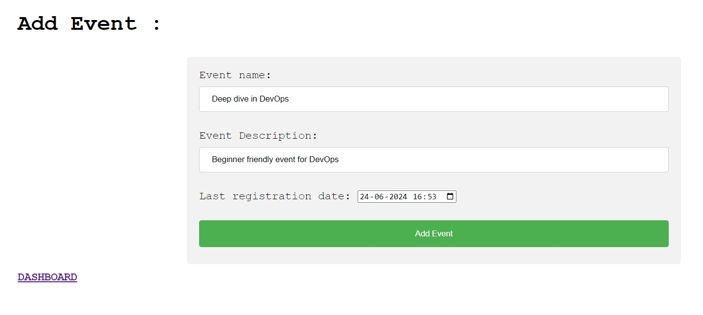

# EventEase : Event Management System developed using Java Spring framework

## The project is deployed <a href='https://ems-spring-boot.onrender.com'>here</a>.
#### Tech stack : Spring Boot, Hibernate, MySQL, Docker

## To run project directly (using Docker) :-

#### 1. Install <a href='https://docs.docker.com/engine/install/'>Docker</a>

#### 2. Pull Docker image for the project:
```sh
docker pull dhruvink79/ems-spring-boot
```

#### 3. Provide <code>ENV</code> variables and spin up the docker container
```sh
docker run -it -p 8080:8080 \
MYSQL_HOST= \
MYSQL_DATABASE= \
MYSQL_PORT= \
MYSQL_USER= \
MYSQL_PASSWORD= \
dhruvink79/ems-spring-boot
```
#### Now you are up and running.


## Major Functionalities :

### Club Admin user
1. login/signup as admin user.
2. organize event.
3. update event details.
4. cancel upcoming events.
5. view participation details.

### Student user
1. student register and login.
2. participate and cancel participation in an event.
3. view participation history.


## ER diagram :


## System Screenshots :

#### 1. club dashboard


#### 2. organize event


#### 3. event details


#### 4. student registration


#### 5. student dashboard


#### 6. participation history


##### some useful links : https://www.baeldung.com/spring-data-derived-queries
